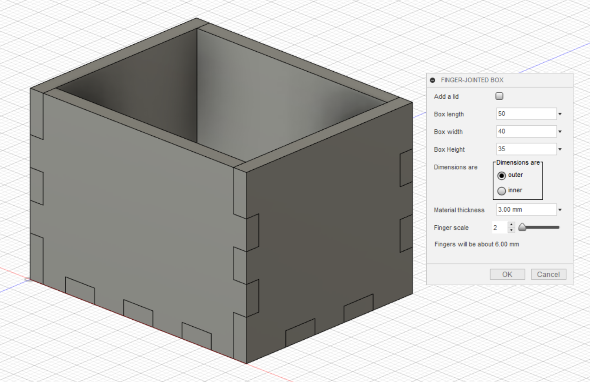
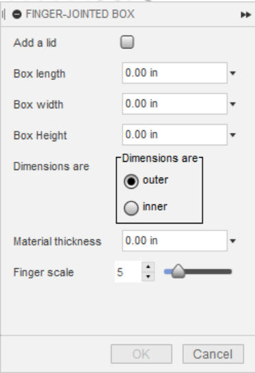

# Boxer
Boxer is an add-in for generating finger-jointed boxes in Autodesk Fusion 360.
These types of boxes are particularly well-suited to laser-cutting, and can be built out of MDF, plywood, acrylic, or any similar material.

## Installation

Autodesk has instructions for installing add-ins [on their website](https://knowledge.autodesk.com/support/fusion-360/troubleshooting/caas/sfdcarticles/sfdcarticles/How-to-install-an-ADD-IN-and-Script-in-Fusion-360.html).

## Use

Boxer is accessed via the Solid/Create menu in Fusion. Open the menu and click
the "Finger-Jointed Box" item. That will bring up Boxer's dialog:

Checking the "Add a lid" button will create a 6-sided box with a finger-jointed lid; leaving it blank will result in a an open-topped box.

By default, the length, width, and height will be exterior dimensions, but if you select the "inner" radio button they will be treated as interior dimensions; in this case Boxer will add the material thickness to the values you specify to determine the outer dimensions before constructing the box.

"Finger scale" sets the target width for the fingers as a multiple of the material thickness. If your material is 5mm and the finger scale is 3, Boxer will try to create fingers approximately 15mm wide. Boxer adjusts the final size of the fingers so that they are all equal, and also so that there are at least 3 fingers per side.

The box will be created on the root component's XZ construction plane, at the origin. The box will be created as a new component containing the sketches and bodies used to construct it.

### Editing a Box

Fusion 360 doesn't currently allow add-ins to create an editable operation on the timeline that you can use to recall and edit the add-in's dialog box. Boxer does create a number of sketches and extrude and combine operations, and you can edit those after the box is created, but changing the dimensions or material thickness this way is more complicated than it would be if Fusion 360 allowed add-ins to create an editable operation on the timeline.

### Producing DXF Output for Laser Cutting

I use another Fusion 360 add-in for this, "DXF for Laser", which is free and available in the Fusion 360 store.
